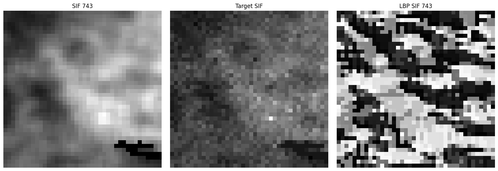
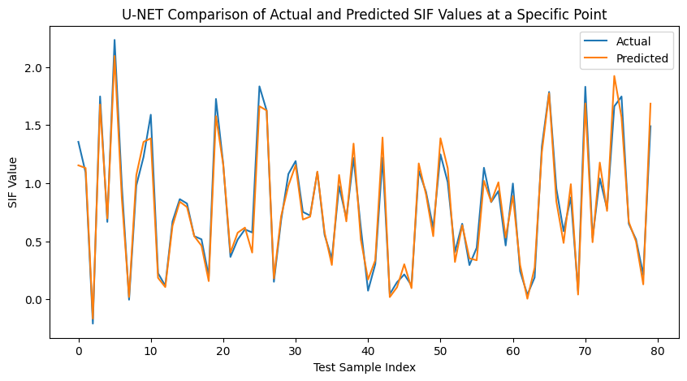
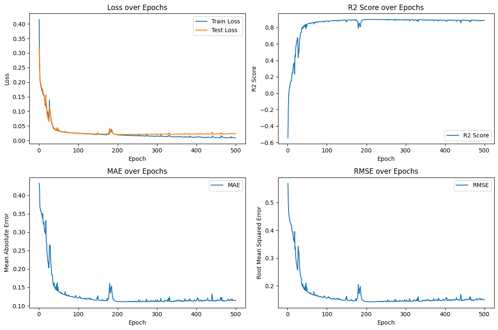

# Geospatial Data Downscaling with U-Net and Local Binary Patterns
#### © 2024 Sudarshan Zunja 

## Abstract

Geospatial data from satellites often comes with varying resolutions due to geographic, environmental, and climatic factors. This research focuses on downscaling lower-resolution TROPOMI-SIF data to higher resolution using MODIS auxiliary data. Local Binary Patterns (LBP) are applied to capture local spatial features, which are then processed using a U-Net model to predict higher-resolution samples.

## Data Collection

### Sentinel-5P TROPOMI SIF

Sentinel-5P's TROPOMI-SIF provides sun-induced fluorescence (SIF) data crucial for vegetation analysis. The data is aggregated at a resolution of 3.5x7 km for 2019. [Download TROPOMI-SIF Data](https://ftp.sron.nl/open-access-data-2/TROPOMI/tropomi/sif/v2.1/l2b/)

### MODIS Terra Vegetation Indices

MODIS provides vegetation indices at 1x1 km resolution on 16-day intervals for 2019. [Download MODIS Data](https://search.earthdata.nasa.gov/search?q=C2565788905-LPCLOUD)

Alternative sources for MODIS data are available based on product needs. For more information, visit [MODIS Data](https://modis.gsfc.nasa.gov/data/dataprod/).

## Data Extraction

- **TROPOMI-SIF**: Available in NETCDF4 format, specifically the SIF743 product.
- **MODIS**: Available in HDF format.

Convert these to CSV or other standard formats for further processing.

## QGIS and Data Synthesis

QGIS is used for data synthesis:

- **SIF Data Synthesis**: Import daily SIF data, aggregate to a coarse resolution, and match to a 1x1 km grid.
- **MODIS Data Synthesis**: Convert MODIS data to a 1x1 km grid.
- **SIF-MODIS Integration**: Integrate SIF and MODIS data grid-wise, aggregating over 16-day intervals.

## Feature Extraction

Extract features by correlating SIF743 with MODIS indices and calculating the SIF difference. Apply Local Binary Patterns (LBP) to SIF743 to enhance texture information.

## Matrix Generation

Preprocess the dataset, handle NaN values, and generate spatial matrices. Stack matrices for each feature and crop them to MxM size.

## Local Binary Pattern (LBP)

Apply LBP to SIF743 for localized texture extraction and pattern recognition.

## Matrix Cropping and Generation of Input Data

Crop matrices to MxM size using random selection or sliding window techniques. Prepare the cropped matrices for input into the U-Net model.

## U-Net Model Training and Testing

Train a U-Net model with:
- **5 Encoder Blocks**: Each block includes two convolutional layers with ReLU activation, with filters increasing from 16 to 256.
- **Bottleneck**: Uses 512 filters.
- **5 Decoder Blocks**: Each includes upscaling, concatenation with feature maps from Encoder Blocks, and additional convolutional layers, with filters decreasing from 256 to 16.
- **Final Layer**: Outputs a single-channel prediction.

Adjust model parameters for optimal performance.

## Getting Started

- **Refer to `data_curation.ipynb`** for steps on data extraction and curation.
- **Software**: QGIS for data curation.
- **Data Formats**: TROPOMI_SIF (NETCDF), MODIS (HDF).

## License

This project is licensed under the MIT License. See the [LICENSE](LICENSE) file for details.

## Acknowledgements

Thanks to the creators of the Sentinel-5P TROPOMI and MODIS datasets, and the developers of the U-Net architecture.
