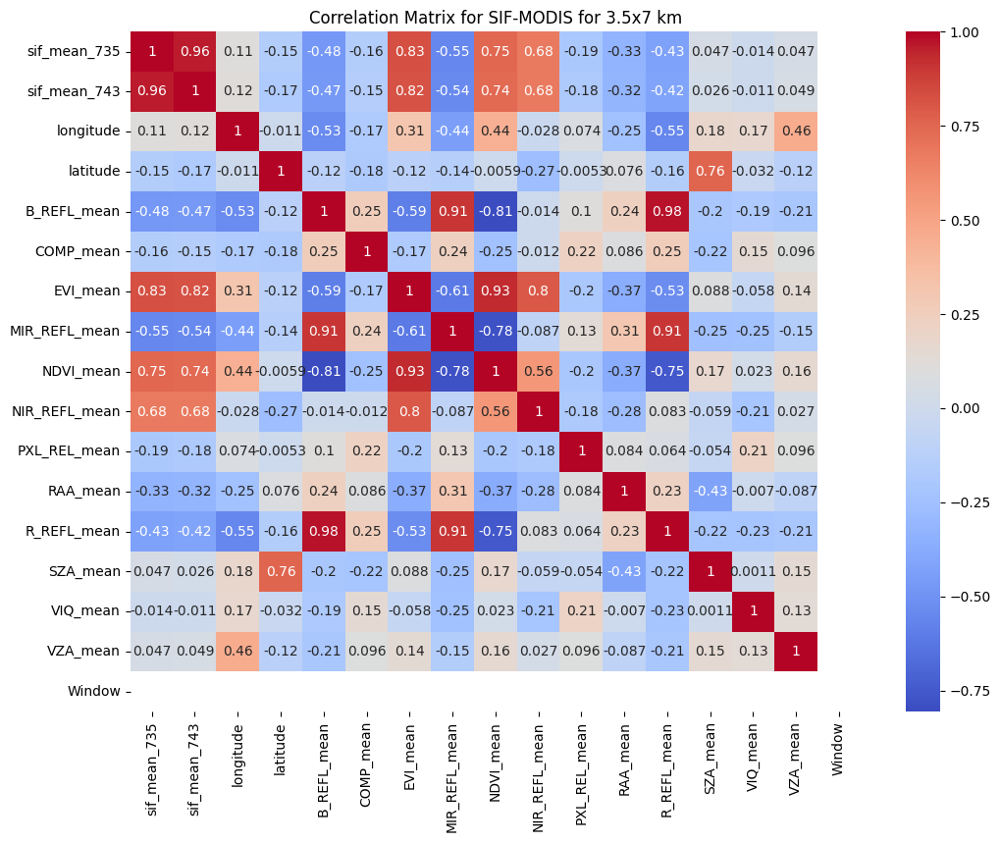
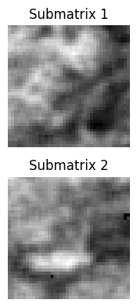
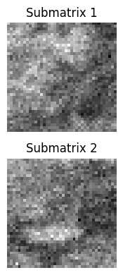
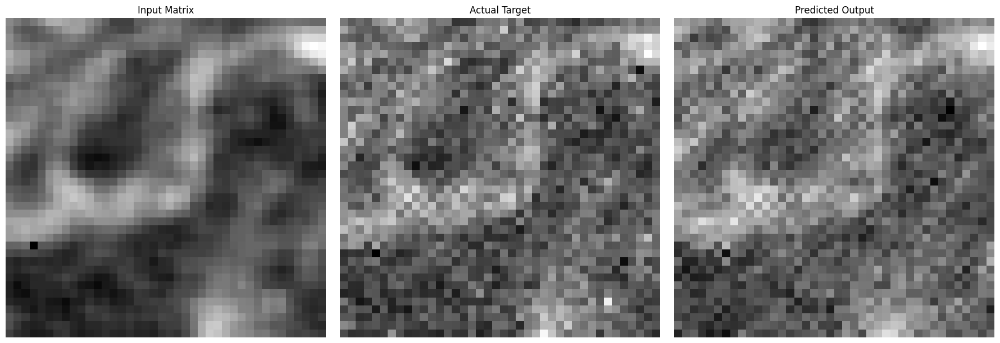
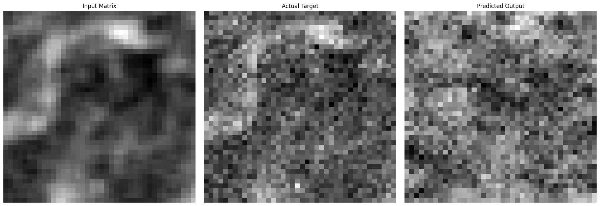
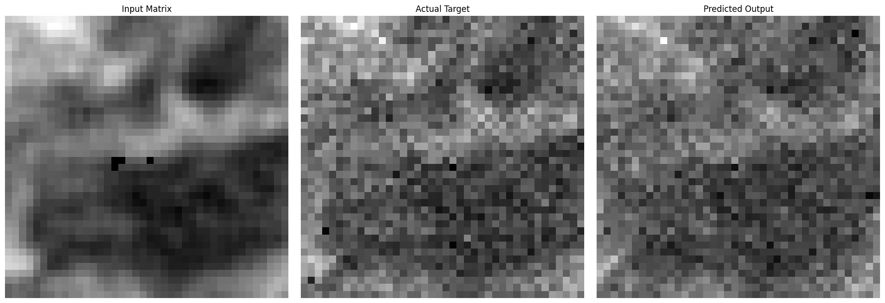
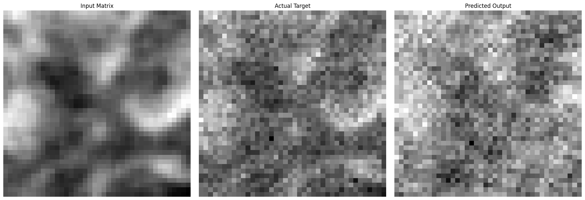

# Downscaling Geo-Spatio-Temporal SIF Data with MODIS  using Convolutional Neural Networks 


# Data Used and Curation

Datasource for MODIS-1km-16Day: https://search.earthdata.nasa.gov/search?q=C2565788905-LPCLOUD

Datasource for TROPOSIF-June-2019: https://ftp.sron.nl/open-access-data-2/TROPOMI/tropomi/sif/v2.1/l2b/


Refer to **data_curation.ipynb** for steps on how data is extracted and curated.

**QGIS** is used as the primary geographic information system software for data curation.

Data formats:
        
        TROPOMI_SIF:      **NETCDF format**
        
        MODIS:            **HDF format**

### Import basic necessary libraries


```python
import pandas as pd
import seaborn as sns
import matplotlib.pyplot as plt
import numpy as np
```

### Import Integrated SIF-MODIS datasets


```python
# ensure constant shape of data even across variable temporal set
# consider lower resolution data as input against higher resolution target

seven_data = pd.read_csv('SIF_MODIS_Integrated_7x14km_25_MAY_09_JUNE.csv')
three_data = pd.read_csv('SIF_MODIS_Integrated_3.5x7km_25_MAY_09_JUNE.csv')

seven2 = pd.read_csv('SIF_MODIS_Integrated_7x14km_10_JUNE_25_JUNE.csv')
three2 = pd.read_csv('SIF_MODIS_Integrated_3.5x7km_10_JUNE_25_JUNE.csv')

three_data.drop(['fid', 'Window'], axis=1, inplace=True)
three2.drop(['fid'], axis=1, inplace=True)

seven_data['Window'] = 0
three_data['Window'] = 0
seven2['Window'] = 1
three2['Window'] = 1

print(seven_data.shape, three_data.shape, seven2.shape, three2.shape)
```

    (16603, 17) (16603, 17) (16586, 17) (16586, 17)
    


```python
three2.head()
```


<div>
<style scoped>
    .dataframe tbody tr th:only-of-type {
        vertical-align: middle;
    }

    .dataframe tbody tr th {
        vertical-align: top;
    }

    .dataframe thead th {
        text-align: right;
    }
</style>
<table border="1" class="dataframe">
  <thead>
    <tr style="text-align: right;">
      <th></th>
      <th>sif_mean_735</th>
      <th>sif_mean_743</th>
      <th>longitude</th>
      <th>latitude</th>
      <th>B_REFL_mean</th>
      <th>EVI_mean</th>
      <th>MIR_REFL_mean</th>
      <th>NDVI_mean</th>
      <th>NIR_REFL_mean</th>
      <th>PXL_REL_mean</th>
      <th>R_REFL_mean</th>
      <th>RAA_mean</th>
      <th>SZA_mean</th>
      <th>VIQ</th>
      <th>VZA_mean</th>
      <th>COMP_mean</th>
      <th>Window</th>
    </tr>
  </thead>
  <tbody>
    <tr>
      <th>0</th>
      <td>0.588446</td>
      <td>0.593294</td>
      <td>-100.961570</td>
      <td>49.762859</td>
      <td>461.000000</td>
      <td>3111.916667</td>
      <td>2015.625000</td>
      <td>5034.541667</td>
      <td>2713.083333</td>
      <td>2.333333</td>
      <td>878.652174</td>
      <td>743.500000</td>
      <td>2922.750000</td>
      <td>NaN</td>
      <td>2389.250000</td>
      <td>169.8</td>
      <td>1</td>
    </tr>
    <tr>
      <th>1</th>
      <td>0.926404</td>
      <td>1.064461</td>
      <td>-100.915709</td>
      <td>49.762859</td>
      <td>491.280000</td>
      <td>3049.560000</td>
      <td>2066.960000</td>
      <td>4851.120000</td>
      <td>2745.400000</td>
      <td>2.000000</td>
      <td>945.000000</td>
      <td>-1802.260870</td>
      <td>2910.200000</td>
      <td>NaN</td>
      <td>2645.086957</td>
      <td>173.0</td>
      <td>1</td>
    </tr>
    <tr>
      <th>2</th>
      <td>0.721843</td>
      <td>0.925304</td>
      <td>-100.823989</td>
      <td>49.762859</td>
      <td>508.478261</td>
      <td>3445.565217</td>
      <td>1649.043478</td>
      <td>5179.695652</td>
      <td>3021.521739</td>
      <td>NaN</td>
      <td>962.086957</td>
      <td>-4736.157895</td>
      <td>3004.363636</td>
      <td>NaN</td>
      <td>2848.863636</td>
      <td>NaN</td>
      <td>1</td>
    </tr>
    <tr>
      <th>3</th>
      <td>0.467859</td>
      <td>0.821799</td>
      <td>-100.686408</td>
      <td>49.762859</td>
      <td>472.304348</td>
      <td>3197.652174</td>
      <td>1445.260870</td>
      <td>5135.521739</td>
      <td>2729.565217</td>
      <td>1.000000</td>
      <td>876.826087</td>
      <td>4716.888889</td>
      <td>2846.166667</td>
      <td>NaN</td>
      <td>2112.142857</td>
      <td>175.0</td>
      <td>1</td>
    </tr>
    <tr>
      <th>4</th>
      <td>0.777352</td>
      <td>1.183632</td>
      <td>-100.594687</td>
      <td>49.762859</td>
      <td>383.040000</td>
      <td>3696.920000</td>
      <td>1292.333333</td>
      <td>5915.000000</td>
      <td>2843.880000</td>
      <td>1.000000</td>
      <td>727.040000</td>
      <td>11554.523810</td>
      <td>2780.200000</td>
      <td>NaN</td>
      <td>1844.960000</td>
      <td>NaN</td>
      <td>1</td>
    </tr>
  </tbody>
</table>
</div>


```python
three_data.head(5)
```


<div>
<style scoped>
    .dataframe tbody tr th:only-of-type {
        vertical-align: middle;
    }

    .dataframe tbody tr th {
        vertical-align: top;
    }

    .dataframe thead th {
        text-align: right;
    }
</style>
<table border="1" class="dataframe">
  <thead>
    <tr style="text-align: right;">
      <th></th>
      <th>sif_mean_735</th>
      <th>sif_mean_743</th>
      <th>longitude</th>
      <th>latitude</th>
      <th>B_REFL_mean</th>
      <th>COMP_mean</th>
      <th>EVI_mean</th>
      <th>MIR_REFL_mean</th>
      <th>NDVI_mean</th>
      <th>NIR_REFL_mean</th>
      <th>PXL_REL_mean</th>
      <th>RAA_mean</th>
      <th>R_REFL_mean</th>
      <th>SZA_mean</th>
      <th>VIQ_mean</th>
      <th>VZA_mean</th>
      <th>Window</th>
    </tr>
  </thead>
  <tbody>
    <tr>
      <th>0</th>
      <td>0.686501</td>
      <td>0.883585</td>
      <td>-100.502966</td>
      <td>49.762859</td>
      <td>566.200000</td>
      <td>NaN</td>
      <td>1904.458333</td>
      <td>2100.320000</td>
      <td>3345.600000</td>
      <td>2201.040000</td>
      <td>NaN</td>
      <td>12167.791667</td>
      <td>1089.480000</td>
      <td>2946.625000</td>
      <td>NaN</td>
      <td>138.560000</td>
      <td>0</td>
    </tr>
    <tr>
      <th>1</th>
      <td>0.204931</td>
      <td>0.312943</td>
      <td>-100.457106</td>
      <td>49.762859</td>
      <td>584.115385</td>
      <td>157.0</td>
      <td>1561.538462</td>
      <td>2351.269231</td>
      <td>2888.346154</td>
      <td>1983.769231</td>
      <td>NaN</td>
      <td>11956.240000</td>
      <td>1093.884615</td>
      <td>2904.818182</td>
      <td>NaN</td>
      <td>320.160000</td>
      <td>0</td>
    </tr>
    <tr>
      <th>2</th>
      <td>0.152724</td>
      <td>0.336108</td>
      <td>-100.365385</td>
      <td>49.762859</td>
      <td>575.153846</td>
      <td>157.0</td>
      <td>1640.576923</td>
      <td>2441.576923</td>
      <td>3011.500000</td>
      <td>1999.461538</td>
      <td>NaN</td>
      <td>11938.363636</td>
      <td>1071.615385</td>
      <td>2892.363636</td>
      <td>NaN</td>
      <td>429.739130</td>
      <td>0</td>
    </tr>
    <tr>
      <th>3</th>
      <td>0.283762</td>
      <td>0.278045</td>
      <td>-100.319525</td>
      <td>49.762859</td>
      <td>545.807692</td>
      <td>157.0</td>
      <td>2041.807692</td>
      <td>2213.600000</td>
      <td>3622.807692</td>
      <td>2189.500000</td>
      <td>NaN</td>
      <td>11920.720000</td>
      <td>1025.269231</td>
      <td>2914.250000</td>
      <td>NaN</td>
      <td>482.960000</td>
      <td>0</td>
    </tr>
    <tr>
      <th>4</th>
      <td>0.291853</td>
      <td>0.370085</td>
      <td>-100.273665</td>
      <td>49.762859</td>
      <td>540.130435</td>
      <td>157.0</td>
      <td>1786.304348</td>
      <td>2583.086957</td>
      <td>3345.304348</td>
      <td>2002.739130</td>
      <td>NaN</td>
      <td>12004.000000</td>
      <td>1005.434783</td>
      <td>2890.888889</td>
      <td>NaN</td>
      <td>627.772727</td>
      <td>0</td>
    </tr>
  </tbody>
</table>
</div>


### Cross-match (longitude, latitude) values for persistent co-ordinates on either dataset


```python
for idx, row in seven_data.iterrows():
    if row['longitude'] != three_data.loc[idx, 'longitude']:
        print('Longitude mismatch at index:', idx)
    if row['latitude'] != three_data.loc[idx, 'latitude']:
        print('Latitude mismatch at index:', idx)


for idx, row in three_data.iterrows():
    if row['longitude'] != seven_data.loc[idx, 'longitude']:
        print('Longitude mismatch at index:', idx)
    if row['latitude'] != seven_data.loc[idx, 'latitude']:
        print('Latitude mismatch at index:', idx)
```

### Check/fill for NaN values


```python
print(np.isnan(seven2).any())
```

    longitude        False
    latitude         False
    sif_mean_735     False
    sif_mean_743     False
    B_REFL_mean      False
    COMP_mean        False
    EVI_mean          True
    MIR_REFL_mean    False
    NDVI_mean         True
    NIR_REFL_mean     True
    PXL_REL_mean     False
    R_REFL_mean      False
    RAA_mean          True
    SZA_mean         False
    VIQ_mean         False
    VZA_mean          True
    Window           False
    dtype: bool
    


```python
# print(np.isnan(seven_data).any())
seven_data.fillna({
    'COMP_mean': 0,
    'PXL_REL_mean': 0,
    'VIQ_mean': 0
}, inplace=True)

# Check if there are any NaN values left in the DataFrame
print(np.isnan(seven_data).any())
```

    longitude        False
    latitude         False
    sif_mean_735     False
    sif_mean_743     False
    B_REFL_mean      False
    COMP_mean        False
    EVI_mean         False
    MIR_REFL_mean    False
    NDVI_mean        False
    NIR_REFL_mean    False
    PXL_REL_mean     False
    RAA_mean         False
    R_REFL_mean      False
    SZA_mean         False
    VIQ_mean         False
    VZA_mean         False
    Window           False
    dtype: bool
    


```python
# print(np.isnan(three_data).any())
three_data.fillna({
    'COMP_mean': 0,
    'PXL_REL_mean': 0,
    'VIQ_mean': 0
}, inplace=True)

print(np.isnan(three_data).any())
```

    sif_mean_735     False
    sif_mean_743     False
    longitude        False
    latitude         False
    B_REFL_mean      False
    COMP_mean        False
    EVI_mean         False
    MIR_REFL_mean    False
    NDVI_mean        False
    NIR_REFL_mean    False
    PXL_REL_mean     False
    RAA_mean         False
    R_REFL_mean      False
    SZA_mean         False
    VIQ_mean         False
    VZA_mean         False
    Window           False
    dtype: bool
    

### Plot Correlation Matrix, considering sif_743 as target variable


```python
corr = three_data.corr()

plt.figure(figsize=(12, 9))
plt.title('Correlation Matrix for SIF-MODIS for 3.5x7 km')
sns.heatmap(corr, cmap='coolwarm', annot=True)

corr = seven_data.corr()

plt.figure(figsize=(12, 9))
plt.title('Correlation Matrix for SIF-MODIS for 7x14 km')
sns.heatmap(corr, cmap='coolwarm', annot=True)

# NDVI, EVI, NIR are highly correlated to SIF value. Alternatively, SZA Angle could also be included.
```


    <AxesSubplot: title={'center': 'Correlation Matrix for SIF-MODIS for 7x14 km'}>


    

    


    

    


### Extract features and merge them


```python
# merge sif_743 correlated features from lower resolution data along with target sif from higher resolution

merged = []
merged = {
    'longitude': seven_data['longitude'].copy(),
    'latitude': seven_data['latitude'].copy(),
    'sif_743': seven_data['sif_mean_743'].copy(),
    'NDVI': seven_data['NDVI_mean'].copy(),
    'EVI': seven_data['EVI_mean'].copy(),
    'NIR': seven_data['NIR_REFL_mean'].copy(),
    'target_sif': three_data['sif_mean_743'].copy()     # target sif_743 from higher (3.5x7km) resolution
}

merged_df = pd.DataFrame(merged)
merged_df.head(5)
```


<div>
<style scoped>
    .dataframe tbody tr th:only-of-type {
        vertical-align: middle;
    }

    .dataframe tbody tr th {
        vertical-align: top;
    }

    .dataframe thead th {
        text-align: right;
    }
</style>
<table border="1" class="dataframe">
  <thead>
    <tr style="text-align: right;">
      <th></th>
      <th>longitude</th>
      <th>latitude</th>
      <th>sif_743</th>
      <th>NDVI</th>
      <th>EVI</th>
      <th>NIR</th>
      <th>target_sif</th>
    </tr>
  </thead>
  <tbody>
    <tr>
      <th>0</th>
      <td>-100.502966</td>
      <td>49.762859</td>
      <td>0.691817</td>
      <td>3972.114286</td>
      <td>2281.788462</td>
      <td>2287.819048</td>
      <td>0.883585</td>
    </tr>
    <tr>
      <th>1</th>
      <td>-100.457106</td>
      <td>49.762859</td>
      <td>0.548354</td>
      <td>3349.292453</td>
      <td>1896.943396</td>
      <td>2156.669811</td>
      <td>0.312943</td>
    </tr>
    <tr>
      <th>2</th>
      <td>-100.365385</td>
      <td>49.762859</td>
      <td>0.333582</td>
      <td>3063.990476</td>
      <td>1692.438095</td>
      <td>2054.323810</td>
      <td>0.336108</td>
    </tr>
    <tr>
      <th>3</th>
      <td>-100.319525</td>
      <td>49.762859</td>
      <td>0.323240</td>
      <td>3195.285714</td>
      <td>1743.542857</td>
      <td>2036.304762</td>
      <td>0.278045</td>
    </tr>
    <tr>
      <th>4</th>
      <td>-100.273665</td>
      <td>49.762859</td>
      <td>0.294832</td>
      <td>3379.736364</td>
      <td>1842.990909</td>
      <td>2069.290909</td>
      <td>0.370085</td>
    </tr>
  </tbody>
</table>
</div>


```python
# shuffle to avoid overfitting

merged_df.sample(frac=1, ignore_index=True)
```


<div>
<style scoped>
    .dataframe tbody tr th:only-of-type {
        vertical-align: middle;
    }

    .dataframe tbody tr th {
        vertical-align: top;
    }

    .dataframe thead th {
        text-align: right;
    }
</style>
<table border="1" class="dataframe">
  <thead>
    <tr style="text-align: right;">
      <th></th>
      <th>longitude</th>
      <th>latitude</th>
      <th>sif_743</th>
      <th>NDVI</th>
      <th>EVI</th>
      <th>NIR</th>
      <th>target_sif</th>
    </tr>
  </thead>
  <tbody>
    <tr>
      <th>0</th>
      <td>-97.338602</td>
      <td>47.121824</td>
      <td>0.144827</td>
      <td>3189.008929</td>
      <td>1775.428571</td>
      <td>2082.089286</td>
      <td>0.149081</td>
    </tr>
    <tr>
      <th>1</th>
      <td>-96.467256</td>
      <td>47.750642</td>
      <td>0.656195</td>
      <td>4087.027778</td>
      <td>2303.935780</td>
      <td>2205.388889</td>
      <td>0.768460</td>
    </tr>
    <tr>
      <th>2</th>
      <td>-99.585759</td>
      <td>49.699977</td>
      <td>0.669583</td>
      <td>4612.068376</td>
      <td>2497.461538</td>
      <td>2185.239316</td>
      <td>0.656492</td>
    </tr>
    <tr>
      <th>3</th>
      <td>-98.714413</td>
      <td>45.612661</td>
      <td>1.076615</td>
      <td>4919.539130</td>
      <td>2771.121739</td>
      <td>2377.486726</td>
      <td>0.886202</td>
    </tr>
    <tr>
      <th>4</th>
      <td>-95.274887</td>
      <td>48.505223</td>
      <td>0.881706</td>
      <td>6050.218182</td>
      <td>3187.763636</td>
      <td>2258.605505</td>
      <td>0.837652</td>
    </tr>
    <tr>
      <th>...</th>
      <td>...</td>
      <td>...</td>
      <td>...</td>
      <td>...</td>
      <td>...</td>
      <td>...</td>
      <td>...</td>
    </tr>
    <tr>
      <th>16598</th>
      <td>-100.136084</td>
      <td>44.040617</td>
      <td>1.301812</td>
      <td>4303.848739</td>
      <td>2624.470588</td>
      <td>2557.201681</td>
      <td>1.079745</td>
    </tr>
    <tr>
      <th>16599</th>
      <td>-94.953864</td>
      <td>46.681652</td>
      <td>1.187573</td>
      <td>5849.557522</td>
      <td>3525.389381</td>
      <td>2728.642857</td>
      <td>1.223620</td>
    </tr>
    <tr>
      <th>16600</th>
      <td>-96.237954</td>
      <td>48.065051</td>
      <td>0.714172</td>
      <td>4115.482143</td>
      <td>2244.875000</td>
      <td>2099.035714</td>
      <td>0.893850</td>
    </tr>
    <tr>
      <th>16601</th>
      <td>-96.925859</td>
      <td>45.801307</td>
      <td>0.445220</td>
      <td>3779.139130</td>
      <td>2117.530435</td>
      <td>2192.321739</td>
      <td>0.666977</td>
    </tr>
    <tr>
      <th>16602</th>
      <td>-98.943714</td>
      <td>44.229262</td>
      <td>1.191290</td>
      <td>5515.445378</td>
      <td>3203.168067</td>
      <td>2546.420168</td>
      <td>1.115798</td>
    </tr>
  </tbody>
</table>
<p>16603 rows × 7 columns</p>
</div>


```python
input_scaled_df = merged_df[['sif_743', 'NDVI', 'EVI', 'NIR', 'target_sif']]
input_scaled_df.head(5)
```


<div>
<style scoped>
    .dataframe tbody tr th:only-of-type {
        vertical-align: middle;
    }

    .dataframe tbody tr th {
        vertical-align: top;
    }

    .dataframe thead th {
        text-align: right;
    }
</style>
<table border="1" class="dataframe">
  <thead>
    <tr style="text-align: right;">
      <th></th>
      <th>sif_743</th>
      <th>NDVI</th>
      <th>EVI</th>
      <th>NIR</th>
      <th>target_sif</th>
    </tr>
  </thead>
  <tbody>
    <tr>
      <th>0</th>
      <td>0.691817</td>
      <td>3972.114286</td>
      <td>2281.788462</td>
      <td>2287.819048</td>
      <td>0.883585</td>
    </tr>
    <tr>
      <th>1</th>
      <td>0.548354</td>
      <td>3349.292453</td>
      <td>1896.943396</td>
      <td>2156.669811</td>
      <td>0.312943</td>
    </tr>
    <tr>
      <th>2</th>
      <td>0.333582</td>
      <td>3063.990476</td>
      <td>1692.438095</td>
      <td>2054.323810</td>
      <td>0.336108</td>
    </tr>
    <tr>
      <th>3</th>
      <td>0.323240</td>
      <td>3195.285714</td>
      <td>1743.542857</td>
      <td>2036.304762</td>
      <td>0.278045</td>
    </tr>
    <tr>
      <th>4</th>
      <td>0.294832</td>
      <td>3379.736364</td>
      <td>1842.990909</td>
      <td>2069.290909</td>
      <td>0.370085</td>
    </tr>
  </tbody>
</table>
</div>


### Create individual feature matrix with GeoSpatial referencing while normalizing them


```python
def normalize_series(series):
    return (series - series.min()) / (series.max() - series.min())

def create_matrix(data, unique_lats, unique_lons):
    # Create a mapping from latitude/longitude to row/column indices
    lat_to_row = {lat: idx for idx, lat in enumerate(unique_lats)}
    lon_to_col = {lon: idx for idx, lon in enumerate(unique_lons)}

    # Initialize a matrix with NaNs (or zeros) with the appropriate shape
    matrix = np.full((len(unique_lats), len(unique_lons)), np.nan)

    # Populate the matrix with values
    for _, row in data.iterrows():
        lat, lon, value = row['latitude'], row['longitude'], row['value']
        matrix[lat_to_row[lat], lon_to_col[lon]] = value

    return matrix

# Create DataFrames with normalized values
sif_743_data = pd.DataFrame({
    'latitude': seven_data['latitude'],
    'longitude': seven_data['longitude'],
    'value': normalize_series(input_scaled_df['sif_743'])
})
ndvi_data = pd.DataFrame({
    'latitude': seven_data['latitude'],
    'longitude': seven_data['longitude'],
    'value': normalize_series(input_scaled_df['NDVI'])
})
evi_data = pd.DataFrame({
    'latitude': seven_data['latitude'],
    'longitude': seven_data['longitude'],
    'value': normalize_series(input_scaled_df['EVI'])
})
nir_data = pd.DataFrame({
    'latitude': seven_data['latitude'],
    'longitude': seven_data['longitude'],
    'value': normalize_series(input_scaled_df['NIR'])
})
target_sif_data = pd.DataFrame({
    'latitude': seven_data['latitude'],
    'longitude': seven_data['longitude'],
    'value': input_scaled_df['target_sif']
})

unique_lats = sorted(seven_data['latitude'].unique())
unique_lons = sorted(seven_data['longitude'].unique())

# Create matrices with normalized values
sif_743_matrix = create_matrix(sif_743_data, unique_lats, unique_lons)
ndvi_matrix = create_matrix(ndvi_data, unique_lats, unique_lons)
evi_matrix = create_matrix(evi_data, unique_lats, unique_lons)
nir_matrix = create_matrix(nir_data, unique_lats, unique_lons)
target_sif_matrix = create_matrix(target_sif_data, unique_lats, unique_lons)

# Optionally, convert NaNs to zeros if needed
sif_743_matrix = np.nan_to_num(sif_743_matrix)
ndvi_matrix = np.nan_to_num(ndvi_matrix)
evi_matrix = np.nan_to_num(evi_matrix)
nir_matrix = np.nan_to_num(nir_matrix)
target_sif_matrix = np.nan_to_num(target_sif_matrix)

print("SIF 743 Matrix:")
print(sif_743_matrix)
print("NDVI Matrix:")
print(ndvi_matrix)
print("EVI Matrix:")
print(evi_matrix)
print("NIR Matrix:")
print(nir_matrix)
print("Target SIF Matrix:")
print(target_sif_matrix)

```

    SIF 743 Matrix:
    [[0.77174571 0.73166241 0.73486942 ... 0.30061172 0.31825367 0.28179264]
     [0.7680751  0.74960553 0.77476419 ... 0.30750336 0.29866692 0.28317474]
     [0.78392066 0.79328355 0.81922873 ... 0.34181946 0.30143934 0.28678686]
     ...
     [0.30993304 0.33602083 0.34058674 ... 0.16130489 0.15108828 0.13603601]
     [0.31519604 0.33246334 0.35188911 ... 0.12950258 0.         0.15207784]
     [0.32836586 0.32434526 0.34369223 ... 0.13979654 0.14309927 0.2131619 ]]
    NDVI Matrix:
    [[0.87232756 0.87160703 0.85727037 ... 0.60998099 0.63866394 0.60146911]
     [0.78490527 0.7629193  0.77964582 ... 0.58193902 0.59518681 0.55173348]
     [0.75529191 0.75342411 0.78821885 ... 0.58584263 0.55783132 0.52911476]
     ...
     [0.52034655 0.49895634 0.50544188 ... 0.80611423 0.81590849 0.70942646]
     [0.50091759 0.50217097 0.53817328 ... 0.72090528 0.         0.57434246]
     [0.52559254 0.52316038 0.58623941 ... 0.69223672 0.56394968 0.62372469]]
    EVI Matrix:
    [[0.76857038 0.76080192 0.74442847 ... 0.4187096  0.49840976 0.48042816]
     [0.69449398 0.66524751 0.66728031 ... 0.38334319 0.44032758 0.40712266]
     [0.65537004 0.65296376 0.68670541 ... 0.43016466 0.41029295 0.36492478]
     ...
     [0.3982103  0.36835229 0.39343082 ... 0.53606634 0.54527409 0.40048259]
     [0.38703311 0.38723564 0.43666474 ... 0.43038944 0.         0.31578433]
     [0.41607147 0.41734257 0.48325383 ... 0.48198123 0.39336312 0.45666989]]
    NIR Matrix:
    [[0.76687867 0.75563777 0.74605324 ... 0.48043339 0.61262978 0.6308855 ]
     [0.76255735 0.74279636 0.72499625 ... 0.45416468 0.5568111  0.55222572]
     [0.74185269 0.74280188 0.7525925  ... 0.5389885  0.54375669 0.49381001]
     ...
     [0.58524123 0.54756481 0.59778482 ... 0.4580292  0.4622195  0.30474188]
     [0.59646166 0.59117067 0.64424032 ... 0.34347435 0.         0.24375532]
     [0.62029131 0.6290111  0.66461179 ... 0.46965267 0.40293594 0.4665718 ]]
    Target SIF Matrix:
    [[ 1.34042587  1.60660375  1.11564314 ...  0.79435011  0.54667625
       0.5785901 ]
     [ 1.73054931  1.26920118  1.36025192 ...  0.6045526   0.28129028
       0.48617083]
     [ 1.35149446  1.57633558  1.61755959 ...  0.31764706  0.71909998
       0.24441826]
     ...
     [ 0.3432088   0.63238088  0.85916698 ...  0.42406469 -0.20452885
       0.2351677 ]
     [ 0.7871677   0.43354762  0.40870108 ... -0.25710633  0.
       0.123912  ]
     [ 0.53773051  0.51964521  0.68044658 ...  0.19487984  0.39752228
       0.47220336]]
    


```python
ndvi_matrix.shape
```


    (97, 173)


### Generate sub-matrices samples for efficient training


```python
# We have around 16603 instances f data when arranged geo-spatially, they account to a matrix size of (97, 173)
# This singular matrix (,4) is not sufficient to train the model. Hence we need to generate snippets of the original matrix
# by cropping them in equivalent small matrices to populate the training set.

# This size and number of sampels totally depends on the original geo-spatiated matrix.
```


```python
submatrix_size = (40, 40)     # Size can vary based on extent of region under study
num_submatrices = 200  # Number of submatrices to extract, number of samples may vary based on model performance

def get_random_top_left_corners(matrix_shape, submatrix_size, num_submatrices):
    max_row = matrix_shape[0] - submatrix_size[0]
    max_col = matrix_shape[1] - submatrix_size[1]

    top_left_corners = set()
    while len(top_left_corners) < num_submatrices:
        row = np.random.randint(0, max_row + 1)
        col = np.random.randint(0, max_col + 1)
        top_left_corners.add((row, col))

    return list(top_left_corners)

def plot_submatrices(submatrices, num_to_plot=5):
    fig, axes = plt.subplots(num_to_plot, 1, figsize=(8, num_to_plot * 2))
    for i in range(num_to_plot):
        axes[i].imshow(submatrices[i], cmap='gray')
        axes[i].set_title(f'Submatrix {i+1}')
        axes[i].axis('off')
    plt.tight_layout()
    plt.show()

# Get random top-left corners for submatrices
top_left_corners = get_random_top_left_corners(sif_743_matrix.shape, submatrix_size, num_submatrices)
print(top_left_corners)

# Lists to hold the extracted submatrices
sif_submatrices = []
ndvi_submatrices = []
evi_submatrices = []
nir_submatrices = []
target_sif_submatrices = []

# Extract submatrices
for (row, col) in top_left_corners:
    # Extract submatrices for each matrix type
    sif_743_submatrix = sif_743_matrix[row:row + submatrix_size[0], col:col + submatrix_size[1]]
    ndvi_submatrix = ndvi_matrix[row:row + submatrix_size[0], col:col + submatrix_size[1]]
    evi_submatrix = evi_matrix[row:row + submatrix_size[0], col:col + submatrix_size[1]]
    nir_submatrix = nir_matrix[row:row + submatrix_size[0], col:col + submatrix_size[1]]
    target_sif_submatrix = target_sif_matrix[row:row + submatrix_size[0], col:col + submatrix_size[1]]

    # Append submatrices to their respective lists
    sif_submatrices.append(sif_743_submatrix)
    ndvi_submatrices.append(ndvi_submatrix)
    evi_submatrices.append(evi_submatrix)
    nir_submatrices.append(nir_submatrix)
    target_sif_submatrices.append(target_sif_submatrix)

# Convert lists to numpy arrays if needed
sif_submatrices = np.array(sif_submatrices)
ndvi_submatrices = np.array(ndvi_submatrices)
evi_submatrices = np.array(evi_submatrices)
nir_submatrices = np.array(nir_submatrices)
target_sif_submatrices = np.array(target_sif_submatrices)

# Plot some of the extracted submatrices
plot_submatrices(sif_submatrices, num_to_plot=2)
plot_submatrices(target_sif_submatrices, num_to_plot=2)
```

    [(25, 23), (56, 1), (1, 95), (39, 88), (22, 17), (42, 66), (40, 41), (9, 17), (5, 28), (3, 95), (29, 59), (50, 91), (15, 69), (47, 55), (34, 67), (10, 45), (16, 104), (54, 97), (43, 5), (48, 120), (20, 49), (21, 48), (35, 10), (50, 102), (36, 2), (56, 14), (53, 82), (57, 98), (20, 79), (10, 56), (15, 119), (16, 127), (16, 81), (7, 78), (55, 8), (48, 24), (2, 36), (18, 87), (20, 17), (1, 46), (3, 65), (12, 13), (51, 114), (0, 112), (12, 86), (26, 112), (21, 43), (29, 111), (13, 5), (18, 53), (7, 126), (13, 23), (25, 22), (54, 122), (25, 86), (45, 64), (48, 26), (37, 124), (2, 102), (40, 31), (11, 114), (31, 92), (4, 75), (49, 43), (9, 16), (43, 66), (44, 10), (32, 75), (53, 52), (46, 22), (39, 80), (48, 28), (56, 130), (25, 106), (29, 33), (55, 24), (43, 4), (26, 52), (24, 119), (8, 13), (42, 15), (43, 77), (16, 115), (15, 61), (39, 55), (41, 89), (34, 50), (45, 50), (18, 130), (42, 97), (33, 94), (25, 99), (20, 87), (32, 52), (11, 118), (38, 102), (18, 41), (8, 6), (23, 37), (49, 56), (16, 16), (34, 52), (37, 48), (31, 71), (23, 122), (21, 15), (28, 63), (52, 112), (51, 122), (55, 19), (18, 34), (38, 49), (18, 98), (8, 72), (55, 101), (35, 13), (29, 58), (31, 55), (37, 105), (2, 28), (21, 63), (45, 127), (5, 118), (29, 85), (12, 14), (29, 94), (25, 51), (18, 45), (33, 128), (54, 41), (50, 89), (16, 66), (1, 77), (57, 12), (2, 76), (29, 60), (46, 85), (48, 82), (4, 49), (56, 65), (11, 106), (5, 120), (50, 55), (38, 99), (10, 110), (52, 6), (44, 112), (15, 51), (44, 121), (42, 69), (1, 61), (1, 6), (48, 112), (46, 60), (48, 121), (22, 56), (50, 39), (38, 19), (21, 122), (11, 99), (18, 13), (15, 90), (23, 18), (43, 51), (47, 3), (49, 101), (27, 64), (45, 15), (55, 80), (32, 115), (13, 47), (2, 108), (10, 2), (22, 22), (56, 88), (34, 42), (5, 88), (17, 90), (17, 35), (51, 85), (39, 129), (51, 39), (52, 38), (35, 86), (18, 15), (43, 44), (50, 59), (56, 72), (8, 117), (33, 116), (25, 48), (39, 40), (11, 3), (40, 39), (56, 90), (17, 92), (26, 3), (12, 50), (57, 82), (21, 7)]
    


    

    


    

    


```python
target_sif_submatrices[0]
```


    array([[ 1.29063049,  0.71036412,  0.77034522, ...,  0.37756945,
             0.21472293, -0.06606423],
           [ 0.62526465,  0.58973101,  0.61210681, ..., -0.02326698,
             0.34039014,  0.68794457],
           [ 0.73867288,  1.19220658,  0.64542709, ...,  0.20179919,
             0.24534791,  0.07733406],
           ...,
           [ 0.4067043 ,  0.22593603,  0.5908354 , ...,  0.432535  ,
             0.94652685,  0.99547926],
           [ 0.36893214,  0.74421053,  0.3953483 , ...,  0.63217152,
             0.72328609,  0.82854755],
           [ 0.46581852,  0.37410961,  0.38458995, ...,  0.61322162,
             0.46807896,  0.35986131]])


### Create a Spatial Dataset Loader by stacking all submatrices as single input

#### Here each sub-matrice from SIF_743, NDVI, EVI, NIR will act as single input against TARGET_SIF_743 


```python
import torch
from torch.utils.data import Dataset, DataLoader, random_split

submatrices_combined = np.stack([sif_submatrices, ndvi_submatrices, evi_submatrices, nir_submatrices, target_sif_submatrices], axis=1)

# Define a custom Dataset class
class SpatialDataset(Dataset):
    def __init__(self, features, targets):
        self.features = torch.tensor(features, dtype=torch.float32)
        self.targets = torch.tensor(targets, dtype=torch.float32)

    def __len__(self):
        return len(self.features)

    def __getitem__(self, idx):
        return self.features[idx], self.targets[idx]

# Extract features and targets. Confirm if itended features are the first four columns and target sif as last
features = submatrices_combined[:, :4, :, :]  # Shape: (no_of_samples, 4, 40, 40)
targets = submatrices_combined[:, 4:, :, :]   # Shape: (no_of_samples, 1, 40, 40)

# Create the dataset
full_dataset = SpatialDataset(features, targets)

# Split the dataset into train and test sets

# Instead of same temporal dataset, alternative temporal set can be used for testing purpose to validate efficiency of 
# model and ensure if it works for any non-trained instances.

train_size = int(0.8 * len(full_dataset))
test_size = len(full_dataset) - train_size
train_dataset, test_dataset = random_split(full_dataset, [train_size, test_size])

# Create dataloaders
train_dataloader = DataLoader(train_dataset, batch_size=16, shuffle=True)
test_dataloader = DataLoader(test_dataset, batch_size=16, shuffle=False)

```

### Train and Test the CNN Regression Model


```python
import torch.nn as nn
import torch.nn.functional as F
import torch.optim as optim

# Define the CNNRegressor model
class CNNRegressor(nn.Module):
    def __init__(self):
        super(CNNRegressor, self).__init__()
        self.conv1 = nn.Conv2d(in_channels=4, out_channels=32, kernel_size=3, padding=1)
        self.conv2 = nn.Conv2d(in_channels=32, out_channels=64, kernel_size=3, padding=1)
        self.conv3 = nn.Conv2d(in_channels=64, out_channels=128, kernel_size=3, padding=1)
        self.pool = nn.MaxPool2d(kernel_size=2, stride=2, padding=0)

        # Calculate the size after the last pooling layer
        self._to_linear = 128 * 5 * 5  # Adjust based on the actual size

        self.fc1 = nn.Linear(self._to_linear, 512)
        self.fc2 = nn.Linear(512, 40 * 40)  # Output size is 40x40

    def forward(self, x):
        x = self.pool(F.relu(self.conv1(x)))
        x = self.pool(F.relu(self.conv2(x)))
        x = self.pool(F.relu(self.conv3(x)))
        x = x.view(-1, self._to_linear)
        x = F.relu(self.fc1(x))
        x = self.fc2(x)
        x = x.view(-1, 1, 40, 40)  # Reshape to match the target shape
        return x

# Initialize the model, loss function, and optimizer
model = CNNRegressor()
criterion = nn.MSELoss()
optimizer = optim.Adam(model.parameters(), lr=0.001)

# Training loop
num_epochs = 400
for epoch in range(num_epochs):
    model.train()
    running_loss = 0.0
    for inputs, targets in train_dataloader:
        optimizer.zero_grad()

        # Forward pass
        outputs = model(inputs)
        loss = criterion(outputs, targets)

        # Backward pass and optimization
        loss.backward()
        optimizer.step()

        running_loss += loss.item() * inputs.size(0)

    epoch_loss = running_loss / len(train_dataset)
    print(f'Epoch {epoch+1}/{num_epochs}, Loss: {epoch_loss:.4f}')

# Evaluation
model.eval()
with torch.no_grad():
    # Iterate over the test dataloader
    test_predictions = []
    test_targets = []
    for inputs, targets in test_dataloader:
        outputs = model(inputs)
        test_predictions.append(outputs)
        test_targets.append(targets)

    # Concatenate results
    test_predictions = torch.cat(test_predictions, dim=0)
    test_targets = torch.cat(test_targets, dim=0)

    # Print predictions for the first 2 test samples
    for i in range(2):
        print(f"Test Sample {i + 1}:")
        print(f"Predicted:\n{test_predictions[i].numpy()}")
        print(f"Actual:\n{test_targets[i].numpy()}")

```

    Epoch 1/400, Loss: 0.3585
    Epoch 2/400, Loss: 0.1945
    Epoch 3/400, Loss: 0.1556
    Epoch 4/400, Loss: 0.1449
    Epoch 5/400, Loss: 0.1377
    Epoch 6/400, Loss: 0.1207
    Epoch 7/400, Loss: 0.1129
    Epoch 8/400, Loss: 0.1073
    Epoch 9/400, Loss: 0.1018
    Epoch 10/400, Loss: 0.0975
    Epoch 11/400, Loss: 0.0952
    Epoch 12/400, Loss: 0.0943
    Epoch 13/400, Loss: 0.0913
    Epoch 14/400, Loss: 0.0897
    Epoch 15/400, Loss: 0.0885
    Epoch 16/400, Loss: 0.0880
    Epoch 17/400, Loss: 0.0873
    Epoch 18/400, Loss: 0.0863
    Epoch 19/400, Loss: 0.0860
    Epoch 20/400, Loss: 0.0849
    Epoch 21/400, Loss: 0.0838
    Epoch 22/400, Loss: 0.0815
    Epoch 23/400, Loss: 0.0794
    Epoch 24/400, Loss: 0.0784
    Epoch 25/400, Loss: 0.0779
    Epoch 26/400, Loss: 0.0780
    Epoch 27/400, Loss: 0.0755
    Epoch 28/400, Loss: 0.0727
    Epoch 29/400, Loss: 0.0711
    Epoch 30/400, Loss: 0.0686
    Epoch 31/400, Loss: 0.0669
    Epoch 32/400, Loss: 0.0652
    Epoch 33/400, Loss: 0.0651
    Epoch 34/400, Loss: 0.0683
    Epoch 35/400, Loss: 0.0660
    Epoch 36/400, Loss: 0.0621
    Epoch 37/400, Loss: 0.0610
    Epoch 38/400, Loss: 0.0590
    Epoch 39/400, Loss: 0.0579
    Epoch 40/400, Loss: 0.0570
    Epoch 41/400, Loss: 0.0554
    Epoch 42/400, Loss: 0.0542
    Epoch 43/400, Loss: 0.0531
    Epoch 44/400, Loss: 0.0522
    Epoch 45/400, Loss: 0.0511
    Epoch 46/400, Loss: 0.0508
    Epoch 47/400, Loss: 0.0531
    Epoch 48/400, Loss: 0.0536
    Epoch 49/400, Loss: 0.0506
    Epoch 50/400, Loss: 0.0489
    Epoch 51/400, Loss: 0.0478
    Epoch 52/400, Loss: 0.0460
    Epoch 53/400, Loss: 0.0455
    Epoch 54/400, Loss: 0.0444
    Epoch 55/400, Loss: 0.0435
    Epoch 56/400, Loss: 0.0424
    Epoch 57/400, Loss: 0.0418
    Epoch 58/400, Loss: 0.0410
    Epoch 59/400, Loss: 0.0400
    Epoch 60/400, Loss: 0.0392
    Epoch 61/400, Loss: 0.0385
    Epoch 62/400, Loss: 0.0379
    Epoch 63/400, Loss: 0.0371
    Epoch 64/400, Loss: 0.0363
    Epoch 65/400, Loss: 0.0358
    Epoch 66/400, Loss: 0.0351
    Epoch 67/400, Loss: 0.0342
    Epoch 68/400, Loss: 0.0339
    Epoch 69/400, Loss: 0.0335
    Epoch 70/400, Loss: 0.0327
    Epoch 71/400, Loss: 0.0322
    Epoch 72/400, Loss: 0.0313
    Epoch 73/400, Loss: 0.0305
    Epoch 74/400, Loss: 0.0306
    Epoch 75/400, Loss: 0.0305
    Epoch 76/400, Loss: 0.0358
    Epoch 77/400, Loss: 0.0442
    Epoch 78/400, Loss: 0.0367
    Epoch 79/400, Loss: 0.0342
    Epoch 80/400, Loss: 0.0333
    Epoch 81/400, Loss: 0.0305
    Epoch 82/400, Loss: 0.0283
    Epoch 83/400, Loss: 0.0273
    Epoch 84/400, Loss: 0.0263
    Epoch 85/400, Loss: 0.0259
    Epoch 86/400, Loss: 0.0252
    Epoch 87/400, Loss: 0.0244
    Epoch 88/400, Loss: 0.0238
    Epoch 89/400, Loss: 0.0232
    Epoch 90/400, Loss: 0.0227
    Epoch 91/400, Loss: 0.0222
    Epoch 92/400, Loss: 0.0217
    Epoch 93/400, Loss: 0.0211
    Epoch 94/400, Loss: 0.0210
    Epoch 95/400, Loss: 0.0205
    Epoch 96/400, Loss: 0.0201
    Epoch 97/400, Loss: 0.0197
    Epoch 98/400, Loss: 0.0195
    Epoch 99/400, Loss: 0.0191
    Epoch 100/400, Loss: 0.0187
    Epoch 101/400, Loss: 0.0183
    Epoch 102/400, Loss: 0.0179
    Epoch 103/400, Loss: 0.0176
    Epoch 104/400, Loss: 0.0172
    Epoch 105/400, Loss: 0.0168
    Epoch 106/400, Loss: 0.0165
    Epoch 107/400, Loss: 0.0165
    Epoch 108/400, Loss: 0.0162
    Epoch 109/400, Loss: 0.0160
    Epoch 110/400, Loss: 0.0162
    Epoch 111/400, Loss: 0.0159
    Epoch 112/400, Loss: 0.0157
    Epoch 113/400, Loss: 0.0160
    Epoch 114/400, Loss: 0.0158
    Epoch 115/400, Loss: 0.0155
    Epoch 116/400, Loss: 0.0160
    Epoch 117/400, Loss: 0.0168
    Epoch 118/400, Loss: 0.0180
    Epoch 119/400, Loss: 0.0186
    Epoch 120/400, Loss: 0.0193
    Epoch 121/400, Loss: 0.0204
    Epoch 122/400, Loss: 0.0218
    Epoch 123/400, Loss: 0.0172
    Epoch 124/400, Loss: 0.0164
    Epoch 125/400, Loss: 0.0142
    Epoch 126/400, Loss: 0.0129
    Epoch 127/400, Loss: 0.0123
    Epoch 128/400, Loss: 0.0117
    Epoch 129/400, Loss: 0.0114
    Epoch 130/400, Loss: 0.0110
    Epoch 131/400, Loss: 0.0108
    Epoch 132/400, Loss: 0.0106
    Epoch 133/400, Loss: 0.0104
    Epoch 134/400, Loss: 0.0101
    Epoch 135/400, Loss: 0.0100
    Epoch 136/400, Loss: 0.0097
    Epoch 137/400, Loss: 0.0095
    Epoch 138/400, Loss: 0.0093
    Epoch 139/400, Loss: 0.0092
    Epoch 140/400, Loss: 0.0090
    Epoch 141/400, Loss: 0.0088
    Epoch 142/400, Loss: 0.0087
    Epoch 143/400, Loss: 0.0085
    Epoch 144/400, Loss: 0.0083
    Epoch 145/400, Loss: 0.0081
    Epoch 146/400, Loss: 0.0080
    Epoch 147/400, Loss: 0.0079
    Epoch 148/400, Loss: 0.0077
    Epoch 149/400, Loss: 0.0076
    Epoch 150/400, Loss: 0.0074
    Epoch 151/400, Loss: 0.0072
    Epoch 152/400, Loss: 0.0072
    Epoch 153/400, Loss: 0.0070
    Epoch 154/400, Loss: 0.0070
    Epoch 155/400, Loss: 0.0070
    Epoch 156/400, Loss: 0.0069
    Epoch 157/400, Loss: 0.0069
    Epoch 158/400, Loss: 0.0067
    Epoch 159/400, Loss: 0.0065
    Epoch 160/400, Loss: 0.0064
    Epoch 161/400, Loss: 0.0063
    Epoch 162/400, Loss: 0.0061
    Epoch 163/400, Loss: 0.0059
    Epoch 164/400, Loss: 0.0058
    Epoch 165/400, Loss: 0.0059
    Epoch 166/400, Loss: 0.0058
    Epoch 167/400, Loss: 0.0059
    Epoch 168/400, Loss: 0.0058
    Epoch 169/400, Loss: 0.0057
    Epoch 170/400, Loss: 0.0055
    Epoch 171/400, Loss: 0.0055
    Epoch 172/400, Loss: 0.0054
    Epoch 173/400, Loss: 0.0054
    Epoch 174/400, Loss: 0.0053
    Epoch 175/400, Loss: 0.0052
    Epoch 176/400, Loss: 0.0051
    Epoch 177/400, Loss: 0.0051
    Epoch 178/400, Loss: 0.0050
    Epoch 179/400, Loss: 0.0049
    Epoch 180/400, Loss: 0.0048
    Epoch 181/400, Loss: 0.0049
    Epoch 182/400, Loss: 0.0046
    Epoch 183/400, Loss: 0.0046
    Epoch 184/400, Loss: 0.0047
    Epoch 185/400, Loss: 0.0045
    Epoch 186/400, Loss: 0.0044
    Epoch 187/400, Loss: 0.0043
    Epoch 188/400, Loss: 0.0043
    Epoch 189/400, Loss: 0.0043
    Epoch 190/400, Loss: 0.0045
    Epoch 191/400, Loss: 0.0047
    Epoch 192/400, Loss: 0.0046
    Epoch 193/400, Loss: 0.0045
    Epoch 194/400, Loss: 0.0051
    Epoch 195/400, Loss: 0.0054
    Epoch 196/400, Loss: 0.0058
    Epoch 197/400, Loss: 0.0055
    Epoch 198/400, Loss: 0.0055
    Epoch 199/400, Loss: 0.0050
    Epoch 200/400, Loss: 0.0044
    Epoch 201/400, Loss: 0.0045
    Epoch 202/400, Loss: 0.0042
    Epoch 203/400, Loss: 0.0040
    Epoch 204/400, Loss: 0.0040
    Epoch 205/400, Loss: 0.0043
    Epoch 206/400, Loss: 0.0042
    Epoch 207/400, Loss: 0.0040
    Epoch 208/400, Loss: 0.0038
    Epoch 209/400, Loss: 0.0035
    Epoch 210/400, Loss: 0.0034
    Epoch 211/400, Loss: 0.0032
    Epoch 212/400, Loss: 0.0030
    Epoch 213/400, Loss: 0.0030
    Epoch 214/400, Loss: 0.0032
    Epoch 215/400, Loss: 0.0033
    Epoch 216/400, Loss: 0.0034
    Epoch 217/400, Loss: 0.0033
    Epoch 218/400, Loss: 0.0033
    Epoch 219/400, Loss: 0.0032
    Epoch 220/400, Loss: 0.0030
    Epoch 221/400, Loss: 0.0034
    Epoch 222/400, Loss: 0.0045
    Epoch 223/400, Loss: 0.0071
    Epoch 224/400, Loss: 0.0073
    Epoch 225/400, Loss: 0.0080
    Epoch 226/400, Loss: 0.0075
    Epoch 227/400, Loss: 0.0051
    Epoch 228/400, Loss: 0.0045
    Epoch 229/400, Loss: 0.0037
    Epoch 230/400, Loss: 0.0032
    Epoch 231/400, Loss: 0.0027
    Epoch 232/400, Loss: 0.0026
    Epoch 233/400, Loss: 0.0025
    Epoch 234/400, Loss: 0.0024
    Epoch 235/400, Loss: 0.0023
    Epoch 236/400, Loss: 0.0022
    Epoch 237/400, Loss: 0.0021
    Epoch 238/400, Loss: 0.0020
    Epoch 239/400, Loss: 0.0019
    Epoch 240/400, Loss: 0.0019
    Epoch 241/400, Loss: 0.0018
    Epoch 242/400, Loss: 0.0018
    Epoch 243/400, Loss: 0.0018
    Epoch 244/400, Loss: 0.0018
    Epoch 245/400, Loss: 0.0017
    Epoch 246/400, Loss: 0.0017
    Epoch 247/400, Loss: 0.0017
    Epoch 248/400, Loss: 0.0016
    Epoch 249/400, Loss: 0.0016
    Epoch 250/400, Loss: 0.0017
    Epoch 251/400, Loss: 0.0018
    Epoch 252/400, Loss: 0.0018
    Epoch 253/400, Loss: 0.0017
    Epoch 254/400, Loss: 0.0017
    Epoch 255/400, Loss: 0.0017
    Epoch 256/400, Loss: 0.0017
    Epoch 257/400, Loss: 0.0017
    Epoch 258/400, Loss: 0.0018
    Epoch 259/400, Loss: 0.0017
    Epoch 260/400, Loss: 0.0018
    Epoch 261/400, Loss: 0.0018
    Epoch 262/400, Loss: 0.0019
    Epoch 263/400, Loss: 0.0021
    Epoch 264/400, Loss: 0.0019
    Epoch 265/400, Loss: 0.0020
    Epoch 266/400, Loss: 0.0020
    Epoch 267/400, Loss: 0.0023
    Epoch 268/400, Loss: 0.0033
    Epoch 269/400, Loss: 0.0052
    Epoch 270/400, Loss: 0.0051
    Epoch 271/400, Loss: 0.0060
    Epoch 272/400, Loss: 0.0071
    Epoch 273/400, Loss: 0.0069
    Epoch 274/400, Loss: 0.0057
    Epoch 275/400, Loss: 0.0046
    Epoch 276/400, Loss: 0.0038
    Epoch 277/400, Loss: 0.0032
    Epoch 278/400, Loss: 0.0029
    Epoch 279/400, Loss: 0.0024
    Epoch 280/400, Loss: 0.0023
    Epoch 281/400, Loss: 0.0022
    Epoch 282/400, Loss: 0.0020
    Epoch 283/400, Loss: 0.0017
    Epoch 284/400, Loss: 0.0016
    Epoch 285/400, Loss: 0.0014
    Epoch 286/400, Loss: 0.0013
    Epoch 287/400, Loss: 0.0012
    Epoch 288/400, Loss: 0.0012
    Epoch 289/400, Loss: 0.0012
    Epoch 290/400, Loss: 0.0011
    Epoch 291/400, Loss: 0.0011
    Epoch 292/400, Loss: 0.0010
    Epoch 293/400, Loss: 0.0010
    Epoch 294/400, Loss: 0.0010
    Epoch 295/400, Loss: 0.0010
    Epoch 296/400, Loss: 0.0010
    Epoch 297/400, Loss: 0.0009
    Epoch 298/400, Loss: 0.0009
    Epoch 299/400, Loss: 0.0009
    Epoch 300/400, Loss: 0.0009
    Epoch 301/400, Loss: 0.0008
    Epoch 302/400, Loss: 0.0009
    Epoch 303/400, Loss: 0.0009
    Epoch 304/400, Loss: 0.0008
    Epoch 305/400, Loss: 0.0008
    Epoch 306/400, Loss: 0.0008
    Epoch 307/400, Loss: 0.0008
    Epoch 308/400, Loss: 0.0008
    Epoch 309/400, Loss: 0.0008
    Epoch 310/400, Loss: 0.0008
    Epoch 311/400, Loss: 0.0007
    Epoch 312/400, Loss: 0.0007
    Epoch 313/400, Loss: 0.0007
    Epoch 314/400, Loss: 0.0008
    Epoch 315/400, Loss: 0.0009
    Epoch 316/400, Loss: 0.0009
    Epoch 317/400, Loss: 0.0009
    Epoch 318/400, Loss: 0.0009
    Epoch 319/400, Loss: 0.0011
    Epoch 320/400, Loss: 0.0011
    Epoch 321/400, Loss: 0.0013
    Epoch 322/400, Loss: 0.0016
    Epoch 323/400, Loss: 0.0022
    Epoch 324/400, Loss: 0.0045
    Epoch 325/400, Loss: 0.0054
    Epoch 326/400, Loss: 0.0056
    Epoch 327/400, Loss: 0.0053
    Epoch 328/400, Loss: 0.0048
    Epoch 329/400, Loss: 0.0031
    Epoch 330/400, Loss: 0.0027
    Epoch 331/400, Loss: 0.0019
    Epoch 332/400, Loss: 0.0016
    Epoch 333/400, Loss: 0.0014
    Epoch 334/400, Loss: 0.0013
    Epoch 335/400, Loss: 0.0013
    Epoch 336/400, Loss: 0.0011
    Epoch 337/400, Loss: 0.0009
    Epoch 338/400, Loss: 0.0008
    Epoch 339/400, Loss: 0.0008
    Epoch 340/400, Loss: 0.0007
    Epoch 341/400, Loss: 0.0007
    Epoch 342/400, Loss: 0.0006
    Epoch 343/400, Loss: 0.0006
    Epoch 344/400, Loss: 0.0005
    Epoch 345/400, Loss: 0.0005
    Epoch 346/400, Loss: 0.0004
    Epoch 347/400, Loss: 0.0005
    Epoch 348/400, Loss: 0.0004
    Epoch 349/400, Loss: 0.0005
    Epoch 350/400, Loss: 0.0005
    Epoch 351/400, Loss: 0.0006
    Epoch 352/400, Loss: 0.0006
    Epoch 353/400, Loss: 0.0008
    Epoch 354/400, Loss: 0.0008
    Epoch 355/400, Loss: 0.0008
    Epoch 356/400, Loss: 0.0007
    Epoch 357/400, Loss: 0.0007
    Epoch 358/400, Loss: 0.0007
    Epoch 359/400, Loss: 0.0008
    Epoch 360/400, Loss: 0.0013
    Epoch 361/400, Loss: 0.0013
    Epoch 362/400, Loss: 0.0011
    Epoch 363/400, Loss: 0.0013
    Epoch 364/400, Loss: 0.0015
    Epoch 365/400, Loss: 0.0015
    Epoch 366/400, Loss: 0.0017
    Epoch 367/400, Loss: 0.0015
    Epoch 368/400, Loss: 0.0018
    Epoch 369/400, Loss: 0.0025
    Epoch 370/400, Loss: 0.0021
    Epoch 371/400, Loss: 0.0015
    Epoch 372/400, Loss: 0.0012
    Epoch 373/400, Loss: 0.0010
    Epoch 374/400, Loss: 0.0008
    Epoch 375/400, Loss: 0.0006
    Epoch 376/400, Loss: 0.0005
    Epoch 377/400, Loss: 0.0004
    Epoch 378/400, Loss: 0.0003
    Epoch 379/400, Loss: 0.0003
    Epoch 380/400, Loss: 0.0003
    Epoch 381/400, Loss: 0.0003
    Epoch 382/400, Loss: 0.0002
    Epoch 383/400, Loss: 0.0002
    Epoch 384/400, Loss: 0.0002
    Epoch 385/400, Loss: 0.0002
    Epoch 386/400, Loss: 0.0002
    Epoch 387/400, Loss: 0.0002
    Epoch 388/400, Loss: 0.0002
    Epoch 389/400, Loss: 0.0002
    Epoch 390/400, Loss: 0.0002
    Epoch 391/400, Loss: 0.0002
    Epoch 392/400, Loss: 0.0002
    Epoch 393/400, Loss: 0.0002
    Epoch 394/400, Loss: 0.0002
    Epoch 395/400, Loss: 0.0002
    Epoch 396/400, Loss: 0.0002
    Epoch 397/400, Loss: 0.0002
    Epoch 398/400, Loss: 0.0002
    Epoch 399/400, Loss: 0.0002
    Epoch 400/400, Loss: 0.0002
    Test Sample 1:
    Predicted:
    [[[ 0.3766355   0.7717362   0.7394919  ...  0.48724455  0.68891436
        1.0834416 ]
      [ 0.39774388  0.95549864  0.3669601  ...  0.46714482  1.1540163
        0.47640395]
      [ 0.5746802   0.5060535   0.3044436  ...  0.5930135   0.787873
        0.96463203]
      ...
      [ 0.78656197  0.3437081   0.7437371  ...  0.08578034 -0.03935937
       -0.08181195]
      [ 0.6328833   0.38713357  0.22806653 ...  0.11280286  0.01496112
       -0.0126747 ]
      [ 0.50797373  0.5648771   0.5947906  ... -0.02213159 -0.1658209
        0.17257784]]]
    Actual:
    [[[ 0.740999    1.319118    0.68663    ...  0.67842376  0.71764874
        0.5271577 ]
      [ 0.91015047  1.0137278   1.2806894  ...  0.758965    1.0405805
        1.0595692 ]
      [ 0.9155524   1.0112859   0.90264195 ...  0.8340779   0.9015927
        0.8338282 ]
      ...
      [ 0.29857707  0.39518765  0.5880281  ...  0.11390285  0.1884831
        0.14451163]
      [ 0.3512851   0.32165465  0.11762235 ... -0.1525317  -0.03286681
       -0.0393592 ]
      [ 0.08966484  0.30502734  0.5355975  ... -0.05365549 -0.13422398
        0.2854151 ]]]
    Test Sample 2:
    Predicted:
    [[[ 0.6912701   0.7467178   0.5329964  ... -0.14604405  0.03753337
        0.00915807]
      [ 1.0014682   0.6727909   0.54038846 ...  0.06666839  0.16451786
       -0.26019353]
      [ 0.97064626  0.9462041   0.9195674  ...  0.21920475  0.18706124
        0.36472845]
      ...
      [ 0.6246036   0.4756307   0.6410791  ...  0.8514519   0.6724676
        0.408577  ]
      [ 0.63579214  0.7048805   0.55664146 ...  1.2135485   0.7229229
        0.55868524]
      [ 0.52151847  0.7485226   0.81750876 ...  0.954692    0.5802774
        0.80766535]]]
    Actual:
    [[[ 0.5628058   0.6317274   0.5983081  ... -0.03476406  0.00281805
        0.14607377]
      [ 0.8492227   0.9318269   0.34002092 ... -0.00344334 -0.07377105
        0.3275913 ]
      [ 0.9177476   0.4299293   0.7080831  ...  0.16331474  0.25565326
        0.19586457]
      ...
      [ 0.4872325   0.21696585  0.2033466  ...  0.9318508   1.1524885
        1.0109491 ]
      [ 0.2919424   0.33021602 -0.04907657 ...  0.70388246  0.7501714
        0.9445358 ]
      [ 0.4928211   0.29879057  0.4529839  ...  0.84848046  0.6687563
        0.6217384 ]]]
    

### Plot few sample results


```python
import matplotlib.pyplot as plt

def visualize_input_target_prediction(inputs, targets, predictions, index):
    fig, axes = plt.subplots(1, 3, figsize=(18, 6))

    # Plot input matrix
    axes[0].imshow(inputs[index, 0, :, :], cmap='gray')
    axes[0].set_title('Input Matrix')
    axes[0].axis('off')

    # Plot target matrix
    axes[1].imshow(targets[index, 0, :, :], cmap='gray')
    axes[1].set_title('Actual Target')
    axes[1].axis('off')

    # Plot predicted matrix
    axes[2].imshow(predictions[index, 0, :, :], cmap='gray')
    axes[2].set_title('Predicted Output')
    axes[2].axis('off')

    plt.tight_layout()
    plt.show()

```


```python
test_inputs_np = torch.cat([inputs for inputs, _ in test_dataloader], dim=0).numpy()

visualize_input_target_prediction(test_inputs_np, test_targets.numpy(), test_predictions.numpy(), index=7)
visualize_input_target_prediction(test_inputs_np, test_targets.numpy(), test_predictions.numpy(), index=10)
visualize_input_target_prediction(test_inputs_np, test_targets.numpy(), test_predictions.numpy(), index=15)
visualize_input_target_prediction(test_inputs_np, test_targets.numpy(), test_predictions.numpy(), index=20)
```


    

    


    

    


    

    


    

    


```python

```


```python

```


```python

```


```python

```
